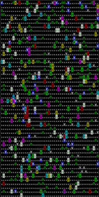

# Sinombre

_"They can make out more than a dozen other islands and black lava ruins that Darwin never had a chance to visit, including an islet known officially as Sin Nombre (that is, Nameless) and another black speck called Eden." - Jonathan Weiner. The Beak of the Finch_

## Demo



## Environment

Create virtual environment

```
virtualenv sinombre-venv
```

Activate

```
source venv/bin/activate
```

Deactivate

```
deactivate
```

## Installing Dependencies

```
pip install -r requirements.txt
```

## Running The Simulator

```
python main.py
```

## Formatting

```
black .
```
